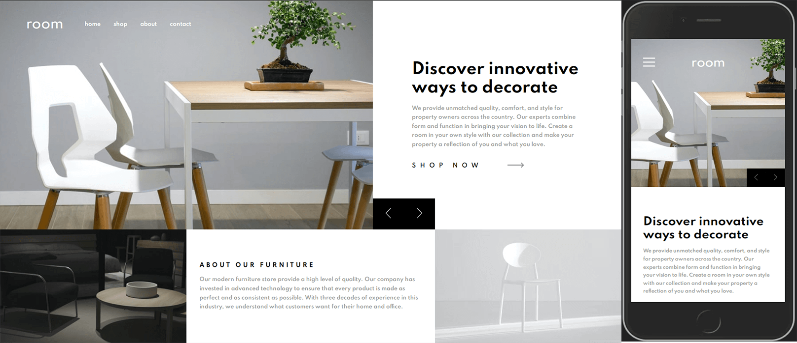

# Frontend Mentor - Room homepage solution

This is a solution to the [Room homepage challenge on Frontend Mentor](https://www.frontendmentor.io/challenges/room-homepage-BtdBY_ENq). Frontend Mentor challenges help you improve your coding skills by building realistic projects. 

## Table of contents

- [Overview](#overview)
  - [The challenge](#the-challenge)
  - [Screenshot](#screenshot)
  - [Links](#links)
- [My process](#my-process)
  - [Built with](#built-with)
  - [What I learned](#what-i-learned)
  - [Continued development](#continued-development)
  - [Useful resources](#useful-resources)
- [Author](#author)
- [Acknowledgments](#acknowledgments)

## Overview

### The challenge

Users should be able to:

- View the optimal layout for the site depending on their device's screen size
- See hover states for all interactive elements on the page
- Navigate the slider using either their mouse/trackpad or keyboard

### Screenshot

### Links

- Solution URL: [Solution CODE](https://github.com/SinisaVukmirovic/FrontEnd-Mentor-challenge-1)
- Live Site URL: [Live Preview](https://sinisavukmirovic.github.io/FrontEnd-Mentor-challenge-1/)

## My process

- Mobile view first | roughly done | to do nav
- working on setting up section with sliders
- desktop view finished
- Slider controls
- Navbar, with hover detail for links
- Slider for text slides
- Slider for background images slides with mobile and desktop images
- detection on viewport width

### Built with

- Semantic HTML5 markup
- CSS custom properties
- Flexbox
- CSS Grid
- Mobile-first workflow
- JS for sliders functionality

### What I learned

- CSS inset property
- Manipulating slides with JS
- using different size images for mobile and desktop

### Useful resources

- [Slider tutorial](https://www.youtube.com/watch?v=9HcxHDS2w1s)
- [Inset shorhand property](https://developer.mozilla.org/en-US/docs/Web/CSS/inset)
- [Detecting device width with JS](https://stackoverflow.com/questions/1248081/how-to-get-the-browser-viewport-dimensions)

## Author

- Website - [Sinisa Vukmirovic](https://github.com/SinisaVukmirovic)
- Frontend Mentor - [@SinisaVukmirovic](https://www.frontendmentor.io/profile/SinisaVukmirovic)
- Twitter - [@sajtowski](https://twitter.com/sajtowski)